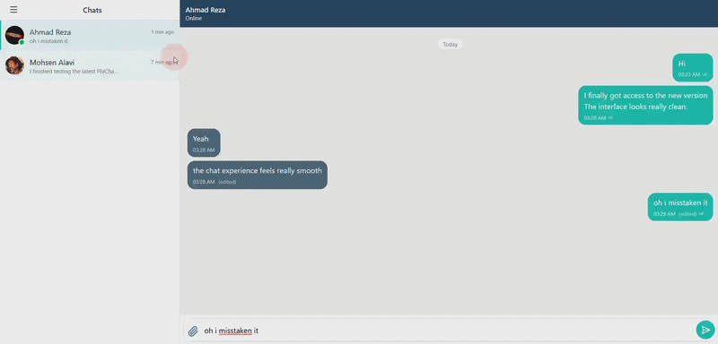

# PhiChat Backend

A secure messaging backend built with **ASP.NET Core 8**.\
PhiChat provides the server-side infrastructure for a real-time
encrypted messaging system, including authentication, message delivery,
chat key management, and user communication features.

> Backend repository of PhiChat.

## Features

-   Real-time messaging using **SignalR**
-   Encrypted message storage (server stores encrypted content)
-   Chat key management for private conversations
-   JWT-based authentication
-   User registration and login
-   Phone-based authentication support
-   Message delivery and read status tracking
-   Reply and forward message support
-   File attachment support
-   Message reactions
-   Contact management
-   User online/offline status
-   Global exception handling middleware
-   Entity Framework Core database layer
-   Docker support

## Architecture

The project follows a layered architecture:

    Phichat.API
        └── Controllers, SignalR Hub, Middleware

    Phichat.Application
        └── DTOs, Interfaces, Validation Rules

    Phichat.Domain
        └── Entities and Core Models

    Phichat.Infrastructure
        └── Database, Services, External Implementations

## Security Approach

PhiChat is designed around encrypted communication:

-   Messages are received and stored as encrypted data.
-   The backend does not process plaintext message content.
-   Chat keys are managed separately from message data.
-   Authentication uses short-lived JWT access tokens (15 min) plus rotating
    refresh tokens in an HttpOnly cookie scoped to `/api/auth`; reuse of a
    rotated refresh token revokes the whole session.
-   Passwords are hashed with salted PBKDF2-HMAC-SHA512 (legacy hashes are
    upgraded transparently on login).
-   Phone sign-up requires a verified SMS code (per-code attempt limit,
    per-phone cooldown and hourly cap; codes are stored as keyed hashes).
-   Login, registration, SMS and upload endpoints are rate limited.
-   Every message operation checks that the caller is a participant;
    forwarded attachments are copied server-side, never taken from the client.
-   Uploaded files are served with `nosniff`, a sandboxing CSP, and as
    downloads unless they are images, audio or video.

> For a complete end-to-end encryption flow, the client application is
> responsible for encryption and decryption operations.

## Technologies

-   **.NET 8**
-   **ASP.NET Core Web API**
-   **SignalR**
-   **Entity Framework Core 8**
-   **SQL Server**
-   **JWT Authentication**
-   **FluentValidation**
-   **Docker**

## Project Structure

    Phichat
    │
    ├── Phichat.API
    │   ├── Controllers
    │   ├── Hubs
    │   └── Middleware
    │
    ├── Phichat.Application
    │   ├── DTOs
    │   ├── Interfaces
    │   └── Validators
    │
    ├── Phichat.Domain
    │   └── Entities
    │
    └── Phichat.Infrastructure
        ├── Data
        ├── Services
        └── Migrations

## Getting Started

### Requirements

-   .NET 8 SDK
-   SQL Server
-   Docker (optional)

### Configuration

Secrets are **not** stored in `appsettings.json`. The API refuses to start
until both of these are configured:

| Setting | Development | Production (environment variable) |
|---|---|---|
| `Jwt:Key` (at least 32 bytes, random) | user-secrets | `Jwt__Key` |
| `ConnectionStrings:DefaultConnection` | `appsettings.Development.json` (local SQL Express) or user-secrets | `ConnectionStrings__DefaultConnection` |

Set the JWT signing key for local development (run once per machine):

``` bash
dotnet user-secrets set "Jwt:Key" "<a-long-random-secret>" --project Phichat.API
```

A suitable key can be generated with `openssl rand -base64 64`.

To use a different database locally, override the connection string the same way:

``` bash
dotnet user-secrets set "ConnectionStrings:DefaultConnection" "<connection-string>" --project Phichat.API
```

Uploaded files (`Phichat.API/Uploads`, `Phichat.API/wwwroot/uploads`) and logs
are runtime data and are ignored by git; the folders are created on startup.

### Database Migration

Run from the repository root (the design-time factory reads the same
appsettings, user-secrets and environment variables as the API):

``` bash
dotnet ef database update --project Phichat.Infrastructure --startup-project Phichat.API
```

### Run the API

``` bash
dotnet run --project Phichat.API
```

The API will start on the configured application URL.

## Real-Time Communication

PhiChat uses SignalR for:

-   Sending messages instantly
-   Receiving online status updates
-   Tracking user presence
-   Delivering real-time events

Hub (clients pass the access token as the `access_token` query parameter):

    /hubs/chat

## API Documentation

Swagger is available in development mode:

    /swagger

## Screenshots / Demo



Recommended additions:

-   Swagger API overview screenshot
-   Database diagram
-   Real-time message flow GIF
-   Client + server communication demo

## Future Improvements

Possible improvements:

-   More advanced encryption key lifecycle management (true end-to-end keys)
-   Automated testing
-   Production deployment configuration

## License

This project is licensed under the terms defined in the repository
license.
